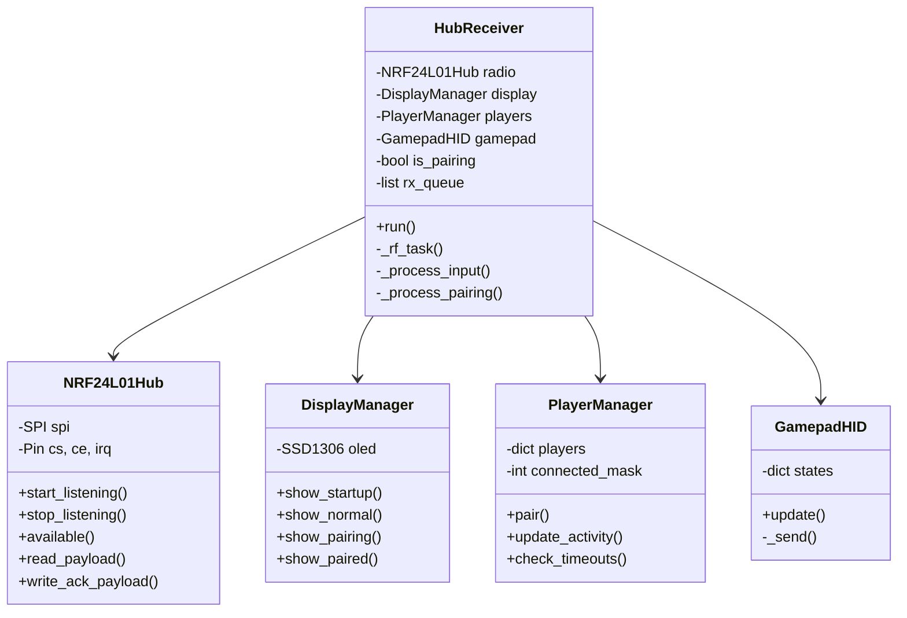

# Dongle Hub Receptor

<p align="center">
  
  
  
  
</p>

El cerebro maestro que coordina hasta 4 instrumentos y los conecta al PC como un gamepad USB estandar.

---

## Tabla de Contenidos

1. [Lista de Componentes](#lista-de-componentes)
2. [Diagrama de Conexiones](#diagrama-de-conexiones)
3. [Arquitectura del Sistema](#arquitectura-del-sistema)
4. [Configuracion USB HID](#configuracion-usb-hid)
5. [Driver NRF24L01](#driver-nrf24l01)
6. [Gestion de Jugadores](#gestion-de-jugadores)
7. [Pantalla OLED](#pantalla-oled)
8. [Protocolo de Comunicacion](#protocolo-de-comunicacion)
9. [Sistema de Emparejamiento](#sistema-de-emparejamiento)
10. [Flujo de Datos](#flujo-de-datos)
11. [Subir el Codigo](#subir-el-codigo)
12. [Solucion de Problemas](#solucion-de-problemas)

---

## Lista de Componentes

### Cerebro

| Componente | Cantidad |
|------------|----------|
| Raspberry Pi Pico (RP2040) | 1 |

### Comunicacion

| Componente | Cantidad |
|------------|----------|
| Modulo NRF24L01 (antena en placa) | 1 |
| Adaptador de voltaje (zocalo 8 pines) | 1 |

### Interfaz

| Componente | Cantidad |
|------------|----------|
| Pantalla OLED 0.96" I2C (SSD1306) | 1 |
| Pulsador tactil (boton Pair) | 1 |
| Cable Micro-USB (datos, no solo carga) | 1 |

---

## Diagrama de Conexiones


### Mapa de Pines Completo

| Pin Pico | GPIO | Funcion | Conexion |
|----------|------|---------|----------|
| 21 | GP16 | SPI MISO | NRF24 MISO |
| 22 | GP17 | NRF24 CE | Chip Enable |
| 24 | GP18 | SPI SCK | NRF24 SCK |
| 25 | GP19 | SPI MOSI | NRF24 MOSI |
| 26 | GP20 | NRF24 CSN | Chip Select |
| 27 | GP21 | NRF24 IRQ | **VITAL para V3** |
| 6 | GP4 | I2C SDA | OLED SDA |
| 7 | GP5 | I2C SCL | OLED SCL |
| 20 | GP15 | PAIR BTN | Pulsador a GND |
| 25 | GP25 | LED | LED interno Pico |
| 36 | 3V3 | Alimentacion | NRF24 VCC (via adaptador) |
| 38 | GND | Tierra | Comun |
| USB | - | USB HID | Al PC |

### Diagrama de Conexion NRF24L01


```
NRF24L01 + Adaptador          Raspberry Pi Pico
+-------------------+         +------------------+
|                   |         |                  |
|  VCC (3.3V) ------+---------+ 3V3 (Pin 36)     |
|  GND        ------+---------+ GND (Pin 38)     |
|                   |         |                  |
|  CE         ------+---------+ GP17 (Pin 22)    |
|  CSN        ------+---------+ GP20 (Pin 26)    |
|  SCK        ------+---------+ GP18 (Pin 24)    |
|  MOSI       ------+---------+ GP19 (Pin 25)    |
|  MISO       ------+---------+ GP16 (Pin 21)    |
|  IRQ        ------+---------+ GP21 (Pin 27)    |  <-- VITAL
|                   |         |                  |
+-------------------+         +------------------+
```

> **IMPORTANTE**: El pin IRQ es fundamental para la arquitectura V3. Permite recepcion basada en interrupciones en lugar de polling constante.

### Diagrama de Conexion OLED


```
OLED SSD1306 (I2C)            Raspberry Pi Pico
+-------------------+         +------------------+
|                   |         |                  |
|  VCC (3.3V) ------+---------+ 3V3 (Pin 36)     |
|  GND        ------+---------+ GND (Pin 38)     |
|  SDA        ------+---------+ GP4 (Pin 6)      |
|  SCL        ------+---------+ GP5 (Pin 7)      |
|                   |         |                  |
+-------------------+         +------------------+
```

---

## Arquitectura del Sistema

### Diagrama de Clases



### Optimizacion Dual-Core

El Pico tiene 2 nucleos. El Dongle los aprovecha:

```
+------------------+          +------------------+
|     CORE 0       |          |     CORE 1       |
+------------------+          +------------------+
|                  |          |                  |
| - USB HID        |          | - RF Reception   |
| - Display OLED   |   <-->   | - IRQ Handling   |
| - Pairing Logic  |  Queue   | - ACK Payloads   |
| - Button Check   |          |                  |
|                  |          |                  |
+------------------+          +------------------+
         |                             |
         v                             v
   +----------+                 +----------+
   |    PC    |                 | NRF24L01 |
   | (USB)    |                 | (2.4GHz) |
   +----------+                 +----------+
```

**Core 0 (Principal)**:
- Maneja USB HID
- Actualiza display OLED
- Procesa boton de pairing
- Lee cola de paquetes recibidos

**Core 1 (RF Task)**:
- Monitorea pin IRQ
- Lee paquetes del radio
- Encola para Core 0
- Recarga ACK payloads

### Cola de Comunicacion Inter-Core

```python
# Cola compartida con lock
self._rx_queue = []
self._queue_lock = _thread.allocate_lock()

# Core 1: Agregar a cola
with self._queue_lock:
    if len(self._rx_queue) < 32:
        self._rx_queue.append((pipe, bytes(data)))

# Core 0: Leer cola
with self._queue_lock:
    packets = self._rx_queue[:]
    self._rx_queue.clear()
```

---

## Configuracion USB HID

### Archivo boot.py

El archivo `boot.py` configura el Pico como gamepad USB al encender:

```python
# Descriptor HID de Gamepad
GAMEPAD_REPORT_DESCRIPTOR = bytes([
    0x05, 0x01,        # Usage Page (Generic Desktop)
    0x09, 0x05,        # Usage (Gamepad)
    0xA1, 0x01,        # Collection (Application)
    0x85, 0x01,        #   Report ID (1)
    
    # 16 Buttons (para 2 jugadores de 8 botones c/u)
    0x05, 0x09,        #   Usage Page (Button)
    0x19, 0x01,        #   Usage Minimum (Button 1)
    0x29, 0x10,        #   Usage Maximum (Button 16)
    0x15, 0x00,        #   Logical Minimum (0)
    0x25, 0x01,        #   Logical Maximum (1)
    0x75, 0x01,        #   Report Size (1)
    0x95, 0x10,        #   Report Count (16)
    0x81, 0x02,        #   Input (Data,Var,Abs)
    
    # X Axis (Whammy Bar)
    0x05, 0x01,        #   Usage Page (Generic Desktop)
    0x09, 0x30,        #   Usage (X)
    0x15, 0x00,        #   Logical Minimum (0)
    0x26, 0xFF, 0x00,  #   Logical Maximum (255)
    0x75, 0x08,        #   Report Size (8)
    0x95, 0x01,        #   Report Count (1)
    0x81, 0x02,        #   Input (Data,Var,Abs)
    
    # Y Axis (Reservado)
    0x09, 0x31,        #   Usage (Y)
    0x81, 0x02,        #   Input (Data,Var,Abs)
    
    0xC0               # End Collection
])
```

### Estructura del Reporte HID

| Byte | Contenido | Descripcion |
|------|-----------|-------------|
| 0 | Report ID | Siempre 0x01 |
| 1 | Buttons Lo | Botones 1-8 (Player 1) |
| 2 | Buttons Hi | Botones 9-16 (Player 2) |
| 3 | Axis X | Whammy bar (0-255) |
| 4 | Axis Y | Reservado (127) |

### Mapeo de Botones por Jugador

```
Player 1 (Byte 1):          Player 2 (Byte 2):
+---+---+---+---+---+---+---+---+   +---+---+---+---+---+---+---+---+
| 7 | 6 | 5 | 4 | 3 | 2 | 1 | 0 |   | 7 | 6 | 5 | 4 | 3 | 2 | 1 | 0 |
+---+---+---+---+---+---+---+---+   +---+---+---+---+---+---+---+---+
|Str|Org|Blu|Yel|Red|Grn|SD |SU |   |   |   |   |   |   |   |   |   |
+---+---+---+---+---+---+---+---+   +---+---+---+---+---+---+---+---+

SU = Strum Up
SD = Strum Down
Grn = Green
Red = Red
Yel = Yellow
Blu = Blue
Org = Orange
Str = Start
```

---

## Driver NRF24L01

### Clase NRF24L01Hub

Driver optimizado para el Hub que actua como receptor multi-pipe:

```python
class NRF24L01Hub:
    def __init__(self, spi, cs, ce, irq_pin):
        # Configuracion inicial
        
    def _init_radio(self):
        # Canal 108, 2Mbps, PA High
        # Auto-ACK en todos los pipes
        # Dynamic payload habilitado
        # ACK payloads habilitados
        
    def set_rx_pipe(self, pipe_num, address):
        # Configura direccion de recepcion
        
    def write_ack_payload(self, pipe, data):
        # Precarga datos para enviar en ACK
        
    def available(self):
        return self.irq.value() == 0  # IRQ activo bajo
        
    def read_payload(self):
        # Lee payload con tamano dinamico
```

### Configuracion del Radio

| Parametro | Valor | Descripcion |
|-----------|-------|-------------|
| Canal | 108 | Evita interferencia WiFi |
| Data Rate | 2Mbps | Maxima velocidad |
| PA Level | HIGH | Potencia alta |
| Payload | Dynamic | Tamano variable |
| CRC | 8-bit | Verificacion errores |
| Auto-ACK | ON | ACK automatico |
| ACK Payload | ON | Datos en respuesta |

### Sistema de Pipes

El radio tiene 6 pipes para recepcion simultanea:

```
Pipe 0: PAIRING_PIPE   (0xE8E8PAIR00)  <-- Solo en modo pairing
Pipe 1: PLAYER_1_PIPE  (0xE8E8F0F001)  <-- Jugador 1
Pipe 2: PLAYER_2_PIPE  (0xE8E8F0F002)  <-- Jugador 2
Pipe 3: PLAYER_3_PIPE  (0xE8E8F0F003)  <-- Jugador 3
Pipe 4: PLAYER_4_PIPE  (0xE8E8F0F004)  <-- Jugador 4
Pipe 5: (no usado)
```

### ACK Payloads

El Hub precarga datos en cada pipe para enviar automaticamente con el ACK:

```python
def _preload_ack_payloads(self):
    for pid in range(1, 5):
        # Formato: [AnimID:4 | ColorID:4]
        color_code = ACK_COLORS.get(pid, 0)
        ack_data = bytes([0x40 | color_code, 0x00])
        self.radio.write_ack_payload(pid, ack_data)
```

Cuando un instrumento envia datos, el radio automaticamente responde con el ACK payload precargado. Esto permite comunicacion bidireccional sin cambiar de modo TX/RX.

---

## Gestion de Jugadores

### Clase PlayerManager

Administra el registro y actividad de jugadores:

```python
class PlayerManager:
    CONFIG_FILE = "/hub_v3.json"
    
    def __init__(self):
        self.players = {}        # player_id -> {device_id, type}
        self.connected_mask = 0  # Bitmask de conexion
        self.last_seen = {}      # Timestamps
```

### Persistencia en Flash

La configuracion se guarda en `/hub_v3.json`:

```json
{
    "1": {"device_id": 45678, "type": 1},
    "2": {"device_id": 12345, "type": 3}
}
```

### Deteccion de Timeout

```python
DEVICE_TIMEOUT_MS = 3000  # 3 segundos

def check_timeouts(self):
    now = time.ticks_ms()
    for pid in list(self.last_seen.keys()):
        if time.ticks_diff(now, self.last_seen[pid]) > DEVICE_TIMEOUT_MS:
            self.connected_mask &= ~(1 << pid)  # Marcar desconectado
```

### Asignacion de Slots

```python
def pair(self, device_id, inst_type):
    # Verificar si ya existe
    existing = self.find_by_device(device_id)
    if existing:
        return existing  # Reusar slot
    
    # Buscar slot libre
    for i in range(1, 5):
        if i not in self.players:
            self.players[i] = {
                "device_id": device_id,
                "type": inst_type
            }
            self._save()
            return i
    
    return None  # Sin slots disponibles
```

---

## Pantalla OLED

### Clase DisplayManager

Maneja la pantalla SSD1306 de 128x64 pixels:

```python
class DisplayManager:
    def show_startup(self):
        # Muestra logo y "Initializing..."
        
    def show_normal(self, players, connected_mask):
        # Lista de jugadores con estado
        
    def show_pairing(self, remaining, found):
        # Animacion de busqueda
        
    def show_paired(self, player_id, inst_type):
        # Confirmacion de emparejamiento
```

### Pantallas de Estado

**Pantalla de Inicio:**
```
+------------------------+
|      GUITAR HERO       |
|      BITSTREAM V3      |
|------------------------|
|    Initializing...     |
+------------------------+
```

**Pantalla Normal:**
```
+------------------------+
|       CONNECTED        |
|------------------------|
| P1* [G] RED            |
| P2  [D] MAGENTA        |
| P3  ---                |
| P4  ---                |
+------------------------+

* = activo recientemente
[G] = Guitar
[D] = Drum
[B] = Bass
```

**Pantalla de Pairing:**
```
+------------------------+
|     PAIRING MODE       |
|------------------------|
|    Searching....       |
|                        |
|    Time: 25s           |
|    Found: 1            |
+------------------------+
```

---

## Protocolo de Comunicacion

### Paquetes de Entrada (Instrumento -> Hub)

**Paquete Normal (2 bytes):**
```
+------------------+------------------+
|     Byte 0       |     Byte 1       |
+------------------+------------------+
|     Buttons      |   Whammy/Vel     |
+------------------+------------------+
```

**Paquete de Pairing (4 bytes):**
```
+--------+--------+--------+--------+
| Byte 0 | Byte 1 | Byte 2 | Byte 3 |
+--------+--------+--------+--------+
|  0xAA  |  Type  | ID Lo  | ID Hi  |
| Magic  |  Inst  |   Device ID     |
+--------+--------+--------+--------+
```

### ACK Payloads (Hub -> Instrumento)

**ACK Normal (2 bytes):**
```
+------------------+------------------+
|     Byte 0       |     Byte 1       |
+------------------+------------------+
| [Anim:4|Color:4] |    Reservado     |
+------------------+------------------+

Bits 7-4: Animation ID
  0x0 = Sin cambio
  0x1 = Wave
  0x2 = Morph
  0x3 = Heartbeat
  0x4 = Solid

Bits 3-0: Color ID
  0x1 = Rojo (P1)
  0x2 = Azul (P2)
  0x3 = Verde (P3)
  0x4 = Magenta (P4)
```

**ACK de Pairing (2 bytes):**
```
+------------------+------------------+
|     Byte 0       |     Byte 1       |
+------------------+------------------+
|    Player ID     |   Color Code     |
|      (1-4)       |      (1-4)       |
+------------------+------------------+
```

---

## Sistema de Emparejamiento

### Flujo Completo

```
[HUB]                                    [INSTRUMENTO]
  |                                            |
  | Usuario mantiene PAIR 5 seg                |
  |<-------------------------------------------|
  |                                            |
  | is_pairing = true                          |
  | Configurar Pipe 0 = PAIRING_PIPE           |
  | Display: "PAIRING MODE"                    |
  |                                            |
  |                      Usuario mantiene PAIR 3 seg
  |                                            |
  |                      LED: Wave blanco      |
  |                                            |
  |         [0xAA, Type, ID_Lo, ID_Hi]         |
  |<-------------------------------------------|
  |                                            |
  | _process_pairing():                        |
  |   - Decodificar device_id                  |
  |   - Buscar/asignar slot                    |
  |   - Guardar en JSON                        |
  |   - Precargar ACK: [PID, Color]            |
  |                                            |
  |         ACK: [Player_ID, Color]            |
  |------------------------------------------->|
  |                                            |
  | Display: "PAIRED! P1 Guitar RED"           |
  |                                            |
  |                      Guardar en EEPROM     |
  |                      LED: Morph a color    |
  |                                            |
  | Timeout 30s o boton PAIR                   |
  | is_pairing = false                         |
  | Volver a modo normal                       |
  |                                            |
  |         Paquetes normales (Pipe 1)         |
  |<==========================================>|
```

### Codigo de Pairing

```python
def _process_pairing(self, data):
    if len(data) < 4:
        return
    
    magic, inst_type, id_lo, id_hi = data[0], data[1], data[2], data[3]
    
    if magic != 0xAA:
        return
    
    device_id = id_lo | (id_hi << 8)
    
    # Asignar slot
    player_id = self.players.pair(device_id, inst_type)
    
    if player_id is None:
        return  # Sin slots
    
    # Preparar ACK con ID y color
    ack_data = bytes([player_id, player_id])  # Color = ID
    self.radio.write_ack_payload(0, ack_data)
    
    # Mostrar confirmacion
    self.display.show_paired(player_id, inst_type)
```

---

## Flujo de Datos

### Diagrama de Flujo Principal

```
                    +------------------+
                    |   INICIALIZACION |
                    +--------+---------+
                             |
                             v
+----------+        +--------+---------+
| Core 1   |        |   LOOP PRINCIPAL |
| RF Task  |<------>|     (Core 0)     |
+----------+        +--------+---------+
     |                       |
     |                       v
     |              +--------+---------+
     |              | Check Pair Button|
     |              +--------+---------+
     |                       |
     |              +--------+---------+
     |              | Pairing Timeout? |
     |              +--------+---------+
     |                       |
     |              +--------+---------+
     |              | Process Queue    |<------ Paquetes de Core 1
     |              +--------+---------+
     |                       |
     |              +--------+---------+
     |              | Check Timeouts   |
     |              +--------+---------+
     |                       |
     |              +--------+---------+
     |              | Update Display   |
     |              +--------+---------+
     |                       |
     +---------------------->+
                             |
                    +--------v---------+
                    |  Loop (1ms)      |
                    +------------------+
```

### Procesamiento de Input

```python
def _process_input(self, pipe, data):
    if len(data) < 2:
        return
    
    player_id = pipe  # Pipe 1 = Player 1
    buttons = data[0]
    axis = data[1]
    
    # Actualizar actividad
    self.players.update_activity(player_id)
    
    # Enviar a USB HID
    self.gamepad.update(player_id, buttons, axis)
    
    # Feedback visual
    self.led.toggle()
```

---

## Subir el Codigo

### Requisitos

1. Raspberry Pi Pico con MicroPython instalado
2. Thonny o cualquier IDE compatible
3. Cable USB de datos (no solo carga)

### Instalacion de MicroPython

1. Descargar MicroPython para Pico desde [micropython.org](https://micropython.org/download/rp2-pico/)
2. Mantener BOOTSEL mientras conectas el Pico
3. Copiar el archivo .uf2 al drive RPI-RP2
4. El Pico reiniciara con MicroPython

### Subir Archivos

1. Conectar el Pico al PC
2. Abrir Thonny
3. Seleccionar interprete: MicroPython (Raspberry Pi Pico)

**Orden de archivos:**

| Archivo | Nombre en Pico | Descripcion |
|---------|----------------|-------------|
| boot.py | boot.py | Configuracion HID (se ejecuta primero) |
| dongle.py | main.py | Codigo principal (se ejecuta despues) |

4. Guardar `boot.py` como `boot.py` en el Pico
5. Guardar `dongle.py` como `main.py` en el Pico
6. Reiniciar el Pico

### Verificar Funcionamiento

1. OLED muestra "GUITAR HERO BITSTREAM V3"
2. Luego muestra lista de jugadores
3. PC detecta nuevo dispositivo "Gamepad"
4. Verificar en Configuracion > Bluetooth y dispositivos > Dispositivos

---

## Solucion de Problemas

| Problema | Causa Probable | Solucion |
|----------|----------------|----------|
| OLED no enciende | Conexion I2C | Verificar SDA/SCL, direccion 0x3C |
| PC no detecta gamepad | boot.py faltante | Verificar que boot.py existe en raiz |
| No recibe datos | Radio no inicializa | Verificar SPI y adaptador 3.3V |
| Instrumentos no emparejan | Hub no en modo pairing | Mantener PAIR 5 segundos |
| Desconexion frecuente | Timeout muy corto | Aumentar DEVICE_TIMEOUT_MS |
| LED interno parpadea errático | RF funcionando | Normal, indica recepcion |
| "No slots available" | 4 jugadores ya asignados | Eliminar hub_v3.json |

### Limpiar Configuracion

Para reiniciar todos los emparejamientos:

1. Conectar con Thonny
2. Ejecutar en REPL:
```python
import os
os.remove("/hub_v3.json")
```
3. Reiniciar el Pico

### Debug Serial

Conectar con Thonny y ver output:

```
Initializing Hub Bitstream V3...
Normal mode active
Hub running!
Pairing request: device=0xABCD, type=1
Assigned Player 1
```

---

## Archivos del Proyecto

```
Dongle/
├── README.md           # Este archivo
├── boot.py             # Configuracion USB HID
├── dongle.py           # Codigo principal (main.py)
└── resource/
    └── diagram/
        └── dongle/
            ├── dongleDiagram.png
            ├── nrf24Diagram.png
            └── oledDiagram.png
```

---

## Licencia

Este codigo es parte del proyecto Guitar Hero Band Controller. Ver [LICENSE](../LICENSE) para detalles.