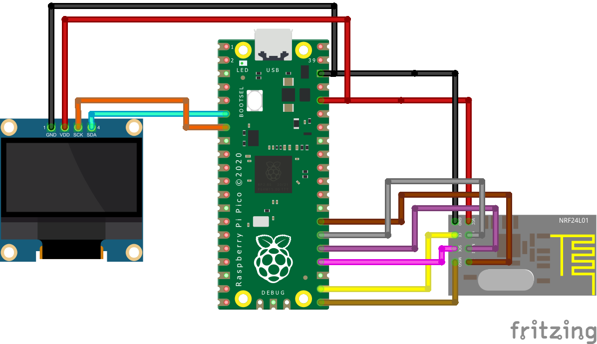
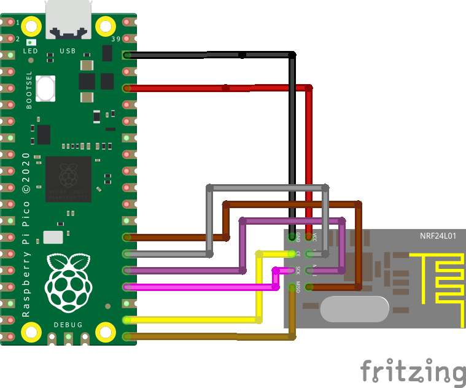
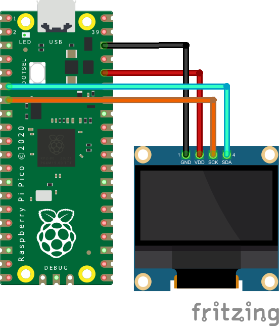
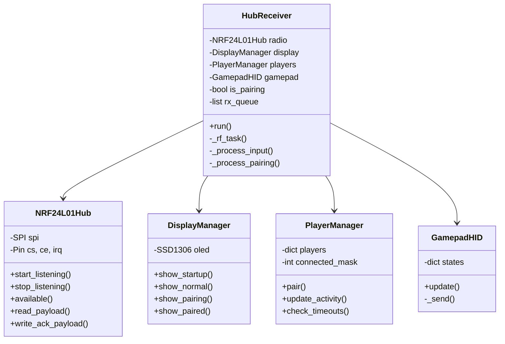

# Dongle Hub Receiver

<p align="center">
  
  
  
  
</p>

The master brain that coordinates up to 4 instruments and connects them to the PC as a standard USB gamepad.

---

## Table of Contents

1. [Bill of Materials](#bill-of-materials)
2. [Wiring Diagram](#wiring-diagram)
3. [System Architecture](#system-architecture)
4. [USB HID Configuration](#usb-hid-configuration)
5. [NRF24L01 Driver](#nrf24l01-driver)
6. [Player Management](#player-management)
7. [OLED Display](#oled-display)
8. [Communication Protocol](#communication-protocol)
9. [Pairing System](#pairing-system)
10. [Data Flow](#data-flow)
11. [Upload Code](#upload-code)
12. [Troubleshooting](#troubleshooting)

---

## Bill of Materials

### Brain

| Component | Quantity |
|-----------|----------|
| Raspberry Pi Pico (RP2040) | 1 |

### Communication

| Component | Quantity |
|-----------|----------|
| NRF24L01 Module (onboard antenna) | 1 |
| Voltage Adapter (8-pin socket) | 1 |

### Interface

| Component | Quantity |
|-----------|----------|
| 0.96" I2C OLED Display (SSD1306) | 1 |
| Tactile Push Button (Pair button) | 1 |
| Micro-USB Cable (data, not charge-only) | 1 |

---

## Wiring Diagram



### Complete Pin Map

| Pico Pin | GPIO | Function | Connection |
|----------|------|----------|------------|
| 21 | GP16 | SPI MISO | NRF24 MISO |
| 22 | GP17 | NRF24 CE | Chip Enable |
| 24 | GP18 | SPI SCK | NRF24 SCK |
| 25 | GP19 | SPI MOSI | NRF24 MOSI |
| 26 | GP20 | NRF24 CSN | Chip Select |
| 27 | GP21 | NRF24 IRQ | **VITAL for V3** |
| 6 | GP4 | I2C SDA | OLED SDA |
| 7 | GP5 | I2C SCL | OLED SCL |
| 20 | GP15 | PAIR BTN | Button to GND |
| 25 | GP25 | LED | Internal Pico LED |
| 36 | 3V3 | Power | NRF24 VCC (via adapter) |
| 38 | GND | Ground | Common |
| USB | - | USB HID | To PC |

### NRF24L01 Connection Diagram



```
NRF24L01 + Adapter            Raspberry Pi Pico
+-------------------+         +------------------+
|                   |         |                  |
|  VCC (3.3V) ------+---------+ 3V3 (Pin 36)     |
|  GND        ------+---------+ GND (Pin 38)     |
|                   |         |                  |
|  CE         ------+---------+ GP17 (Pin 22)    |
|  CSN        ------+---------+ GP20 (Pin 26)    |
|  SCK        ------+---------+ GP18 (Pin 24)    |
|  MOSI       ------+---------+ GP19 (Pin 25)    |
|  MISO       ------+---------+ GP16 (Pin 21)    |
|  IRQ        ------+---------+ GP21 (Pin 27)    |  <-- VITAL
|                   |         |                  |
+-------------------+         +------------------+
```

> **IMPORTANT**: The IRQ pin is fundamental for the V3 architecture. It allows interrupt-based reception instead of constant polling.

### OLED Connection Diagram



```
OLED SSD1306 (I2C)            Raspberry Pi Pico
+-------------------+         +------------------+
|                   |         |                  |
|  VCC (3.3V) ------+---------+ 3V3 (Pin 36)     |
|  GND        ------+---------+ GND (Pin 38)     |
|  SDA        ------+---------+ GP4 (Pin 6)      |
|  SCL        ------+---------+ GP5 (Pin 7)      |
|                   |         |                  |
+-------------------+         +------------------+
```

---

## System Architecture

### Class Diagram



### Dual-Core Optimization

The Pico has 2 cores. The Dongle utilizes both:

```
+------------------+          +------------------+
|      CORE 0      |          |      CORE 1      |
+------------------+          +------------------+
|                  |          |                  |
| - USB HID        |          | - RF Reception   |
| - OLED Display   |   <-->   | - IRQ Handling   |
| - Pairing Logic  |  Queue   | - ACK Payloads   |
| - Button Check   |          |                  |
|                  |          |                  |
+------------------+          +------------------+
         |                             |
         v                             v
   +----------+                 +----------+
   |    PC    |                 | NRF24L01 |
   | (USB)    |                 | (2.4GHz) |
   +----------+                 +----------+
```

**Core 0 (Main)**:
- Handles USB HID
- Updates OLED display
- Processes pairing button
- Reads received packet queue

**Core 1 (RF Task)**:
- Monitors IRQ pin
- Reads packets from radio
- Enqueues for Core 0
- Reloads ACK payloads

### Inter-Core Communication Queue

```python
# Shared queue with lock
self._rx_queue = []
self._queue_lock = _thread.allocate_lock()

# Core 1: Add to queue
with self._queue_lock:
    if len(self._rx_queue) < 32:
        self._rx_queue.append((pipe, bytes(data)))

# Core 0: Read queue
with self._queue_lock:
    packets = self._rx_queue[:]
    self._rx_queue.clear()
```

---

## USB HID Configuration

### boot.py File

The `boot.py` file configures the Pico as a USB gamepad on startup:

```python
# Gamepad HID Descriptor
GAMEPAD_REPORT_DESCRIPTOR = bytes([
    0x05, 0x01,        # Usage Page (Generic Desktop)
    0x09, 0x05,        # Usage (Gamepad)
    0xA1, 0x01,        # Collection (Application)
    0x85, 0x01,        #   Report ID (1)
    
    # 16 Buttons (for 2 players with 8 buttons each)
    0x05, 0x09,        #   Usage Page (Button)
    0x19, 0x01,        #   Usage Minimum (Button 1)
    0x29, 0x10,        #   Usage Maximum (Button 16)
    0x15, 0x00,        #   Logical Minimum (0)
    0x25, 0x01,        #   Logical Maximum (1)
    0x75, 0x01,        #   Report Size (1)
    0x95, 0x10,        #   Report Count (16)
    0x81, 0x02,        #   Input (Data,Var,Abs)
    
    # X Axis (Whammy Bar)
    0x05, 0x01,        #   Usage Page (Generic Desktop)
    0x09, 0x30,        #   Usage (X)
    0x15, 0x00,        #   Logical Minimum (0)
    0x26, 0xFF, 0x00,  #   Logical Maximum (255)
    0x75, 0x08,        #   Report Size (8)
    0x95, 0x01,        #   Report Count (1)
    0x81, 0x02,        #   Input (Data,Var,Abs)
    
    # Y Axis (Reserved)
    0x09, 0x31,        #   Usage (Y)
    0x81, 0x02,        #   Input (Data,Var,Abs)
    
    0xC0               # End Collection
])
```

### HID Report Structure

| Byte | Content | Description |
|------|---------|-------------|
| 0 | Report ID | Always 0x01 |
| 1 | Buttons Lo | Buttons 1-8 (Player 1) |
| 2 | Buttons Hi | Buttons 9-16 (Player 2) |
| 3 | Axis X | Whammy bar (0-255) |
| 4 | Axis Y | Reserved (127) |

### Button Mapping Per Player

```
Player 1 (Byte 1):          Player 2 (Byte 2):
+---+---+---+---+---+---+---+---+   +---+---+---+---+---+---+---+---+
| 7 | 6 | 5 | 4 | 3 | 2 | 1 | 0 |   | 7 | 6 | 5 | 4 | 3 | 2 | 1 | 0 |
+---+---+---+---+---+---+---+---+   +---+---+---+---+---+---+---+---+
|Str|Org|Blu|Yel|Red|Grn|SD |SU |   |   |   |   |   |   |   |   |   |
+---+---+---+---+---+---+---+---+   +---+---+---+---+---+---+---+---+

SU = Strum Up
SD = Strum Down
Grn = Green
Red = Red
Yel = Yellow
Blu = Blue
Org = Orange
Str = Start
```

---

## NRF24L01 Driver

### NRF24L01Hub Class

Driver optimized for the Hub acting as a multi-pipe receiver:

```python
class NRF24L01Hub:
    def __init__(self, spi, cs, ce, irq_pin):
        # Initial configuration
        
    def _init_radio(self):
        # Channel 108, 2Mbps, PA High
        # Auto-ACK on all pipes
        # Dynamic payload enabled
        # ACK payloads enabled
        
    def set_rx_pipe(self, pipe_num, address):
        # Configure receive address
        
    def write_ack_payload(self, pipe, data):
        # Preload data to send in ACK
        
    def available(self):
        return self.irq.value() == 0  # IRQ active low
        
    def read_payload(self):
        # Read payload with dynamic size
```

### Radio Configuration

| Parameter | Value | Description |
|-----------|-------|-------------|
| Channel | 108 | Avoids WiFi interference |
| Data Rate | 2Mbps | Maximum speed |
| PA Level | HIGH | High power |
| Payload | Dynamic | Variable size |
| CRC | 8-bit | Error checking |
| Auto-ACK | ON | Automatic ACK |
| ACK Payload | ON | Data in response |

### Pipe System

The radio has 6 pipes for simultaneous reception:

```
Pipe 0: PAIRING_PIPE   (0xE8E8PAIR00)  <-- Only in pairing mode
Pipe 1: PLAYER_1_PIPE  (0xE8E8F0F001)  <-- Player 1
Pipe 2: PLAYER_2_PIPE  (0xE8E8F0F002)  <-- Player 2
Pipe 3: PLAYER_3_PIPE  (0xE8E8F0F003)  <-- Player 3
Pipe 4: PLAYER_4_PIPE  (0xE8E8F0F004)  <-- Player 4
Pipe 5: (unused)
```

### ACK Payloads

The Hub preloads data into each pipe to be sent automatically with the ACK:

```python
def _preload_ack_payloads(self):
    for pid in range(1, 5):
        # Format: [AnimID:4 | ColorID:4]
        color_code = ACK_COLORS.get(pid, 0)
        ack_data = bytes([0x40 | color_code, 0x00])
        self.radio.write_ack_payload(pid, ack_data)
```

When an instrument sends data, the radio automatically responds with the preloaded ACK payload. This allows bidirectional communication without switching TX/RX modes.

---

## Player Management

### PlayerManager Class

Manages player registration and activity:

```python
class PlayerManager:
    CONFIG_FILE = "/hub_v3.json"
    
    def __init__(self):
        self.players = {}        # player_id -> {device_id, type}
        self.connected_mask = 0  # Connection bitmask
        self.last_seen = {}      # Timestamps
```

### Flash Persistence

Configuration is saved in `/hub_v3.json`:

```json
{
    "1": {"device_id": 45678, "type": 1},
    "2": {"device_id": 12345, "type": 3}
}
```

### Timeout Detection

```python
DEVICE_TIMEOUT_MS = 3000  # 3 seconds

def check_timeouts(self):
    now = time.ticks_ms()
    for pid in list(self.last_seen.keys()):
        if time.ticks_diff(now, self.last_seen[pid]) > DEVICE_TIMEOUT_MS:
            self.connected_mask &= ~(1 << pid)  # Mark as disconnected
```

### Slot Assignment

```python
def pair(self, device_id, inst_type):
    # Check if already exists
    existing = self.find_by_device(device_id)
    if existing:
        return existing  # Reuse slot
    
    # Search for free slot
    for i in range(1, 5):
        if i not in self.players:
            self.players[i] = {
                "device_id": device_id,
                "type": inst_type
            }
            self._save()
            return i
    
    return None  # No slots available
```

---

## OLED Display

### DisplayManager Class

Handles the 128x64 pixel SSD1306 screen:

```python
class DisplayManager:
    def show_startup(self):
        # Shows logo and "Initializing..."
        
    def show_normal(self, players, connected_mask):
        # Player list with status
        
    def show_pairing(self, remaining, found):
        # Search animation
        
    def show_paired(self, player_id, inst_type):
        # Pairing confirmation
```

### Status Screens

**Startup Screen:**
```
+------------------------+
|      GUITAR HERO       |
|      BITSTREAM V3      |
|------------------------|
|    Initializing...     |
+------------------------+
```

**Normal Screen:**
```
+------------------------+
|       CONNECTED        |
|------------------------|
| P1* [G] RED            |
| P2  [D] MAGENTA        |
| P3  ---                |
| P4  ---                |
+------------------------+

* = recently active
[G] = Guitar
[D] = Drum
[B] = Bass
```

**Pairing Screen:**
```
+------------------------+
|     PAIRING MODE       |
|------------------------|
|    Searching....       |
|                        |
|    Time: 25s           |
|    Found: 1            |
+------------------------+
```

---

## Communication Protocol

### Input Packets (Instrument -> Hub)

**Normal Packet (2 bytes):**
```
+------------------+------------------+
|     Byte 0       |     Byte 1       |
+------------------+------------------+
|     Buttons      |   Whammy/Vel     |
+------------------+------------------+
```

**Pairing Packet (4 bytes):**
```
+--------+--------+--------+--------+
| Byte 0 | Byte 1 | Byte 2 | Byte 3 |
+--------+--------+--------+--------+
|  0xAA  |  Type  | ID Lo  | ID Hi  |
| Magic  |  Inst  |   Device ID     |
+--------+--------+--------+--------+
```

### ACK Payloads (Hub -> Instrument)

**Normal ACK (2 bytes):**
```
+------------------+------------------+
|     Byte 0       |     Byte 1       |
+------------------+------------------+
| [Anim:4|Color:4] |    Reserved      |
+------------------+------------------+

Bits 7-4: Animation ID
  0x0 = No change
  0x1 = Wave
  0x2 = Morph
  0x3 = Heartbeat
  0x4 = Solid

Bits 3-0: Color ID
  0x1 = Red (P1)
  0x2 = Blue (P2)
  0x3 = Green (P3)
  0x4 = Magenta (P4)
```

**Pairing ACK (2 bytes):**
```
+------------------+------------------+
|     Byte 0       |     Byte 1       |
+------------------+------------------+
|    Player ID     |   Color Code     |
|      (1-4)       |      (1-4)       |
+------------------+------------------+
```

---

## Pairing System

### Complete Flow

```
[HUB]                                    [INSTRUMENT]
  |                                            |
  | User holds PAIR 5 sec                      |
  |<-------------------------------------------|
  |                                            |
  | is_pairing = true                          |
  | Configure Pipe 0 = PAIRING_PIPE            |
  | Display: "PAIRING MODE"                    |
  |                                            |
  |                      User holds PAIR 3 sec |
  |                                            |
  |                      LED: White Wave       |
  |                                            |
  |         [0xAA, Type, ID_Lo, ID_Hi]         |
  |<-------------------------------------------|
  |                                            |
  | _process_pairing():                        |
  |   - Decode device_id                       |
  |   - Find/assign slot                       |
  |   - Save to JSON                           |
  |   - Preload ACK: [PID, Color]              |
  |                                            |
  |         ACK: [Player_ID, Color]            |
  |------------------------------------------->|
  |                                            |
  | Display: "PAIRED! P1 Guitar RED"           |
  |                                            |
  |                      Save to EEPROM        |
  |                      LED: Morph to color   |
  |                                            |
  | Timeout 30s or PAIR button                 |
  | is_pairing = false                         |
  | Return to normal mode                      |
  |                                            |
  |         Normal Packets (Pipe 1)            |
  |<==========================================>|
```

### Pairing Code

```python
def _process_pairing(self, data):
    if len(data) < 4:
        return
    
    magic, inst_type, id_lo, id_hi = data[0], data[1], data[2], data[3]
    
    if magic != 0xAA:
        return
    
    device_id = id_lo | (id_hi << 8)
    
    # Assign slot
    player_id = self.players.pair(device_id, inst_type)
    
    if player_id is None:
        return  # No slots
    
    # Prepare ACK with ID and color
    ack_data = bytes([player_id, player_id])  # Color = ID
    self.radio.write_ack_payload(0, ack_data)
    
    # Show confirmation
    self.display.show_paired(player_id, inst_type)
```

---

## Data Flow

### Main Flow Diagram

```
                    +------------------+
                    |  INITIALIZATION  |
                    +--------+---------+
                             |
                             v
+----------+        +--------+---------+
| Core 1   |        |    MAIN LOOP     |
| RF Task  |<------>|     (Core 0)     |
+----------+        +--------+---------+
     |                       |
     |                       v
     |              +--------+---------+
     |              | Check Pair Button|
     |              +--------+---------+
     |                       |
     |              +--------+---------+
     |              | Pairing Timeout? |
     |              +--------+---------+
     |                       |
     |              +--------+---------+
     |              | Process Queue    |<------ Packets from Core 1
     |              +--------+---------+
     |                       |
     |              +--------+---------+
     |              | Check Timeouts   |
     |              +--------+---------+
     |                       |
     |              +--------+---------+
     |              | Update Display   |
     |              +--------+---------+
     |                       |
     +---------------------->+
                             |
                    +--------v---------+
                    |   Loop (1ms)     |
                    +------------------+
```

### Input Processing

```python
def _process_input(self, pipe, data):
    if len(data) < 2:
        return
    
    player_id = pipe  # Pipe 1 = Player 1
    buttons = data[0]
    axis = data[1]
    
    # Update activity
    self.players.update_activity(player_id)
    
    # Send to USB HID
    self.gamepad.update(player_id, buttons, axis)
    
    # Visual feedback
    self.led.toggle()
```

---

## Upload Code

### Requirements

1. Raspberry Pi Pico with MicroPython installed
2. Thonny or any compatible IDE
3. USB Data cable (not charge-only)

### MicroPython Installation

1. Download MicroPython for Pico from [micropython.org](https://micropython.org/download/rp2-pico/)
2. Hold BOOTSEL while plugging in the Pico
3. Copy the .uf2 file to the RPI-RP2 drive
4. The Pico will reboot with MicroPython

### Upload Files

1. Connect the Pico to the PC
2. Open Thonny
3. Select interpreter: MicroPython (Raspberry Pi Pico)

**File Order:**

| File | Name on Pico | Description |
|------|--------------|-------------|
| boot.py | boot.py | HID Configuration (runs first) |
| dongle.py | main.py | Main code (runs after) |

4. Save `boot.py` as `boot.py` on the Pico
5. Save `dongle.py` as `main.py` on the Pico
6. Restart the Pico

### Verify Functionality

1. OLED shows "GUITAR HERO BITSTREAM V3"
2. Then shows player list
3. PC detects new "Gamepad" device
4. Verify in Settings > Bluetooth & devices > Devices

---

## Troubleshooting

| Problem | Probable Cause | Solution |
|---------|----------------|----------|
| OLED doesn't turn on | I2C connection | Check SDA/SCL, address 0x3C |
| PC doesn't detect gamepad | Missing boot.py | Check that boot.py exists in root |
| No data received | Radio doesn't init | Check SPI and 3.3V adapter |
| Instruments don't pair | Hub not in pairing mode | Hold PAIR for 5 seconds |
| Frequent disconnection | Timeout too short | Increase DEVICE_TIMEOUT_MS |
| Internal LED flickers erratically | RF working | Normal, indicates reception |
| "No slots available" | 4 players already assigned | Delete hub_v3.json |

### Clear Configuration

To reset all pairings:

1. Connect with Thonny
2. Run in REPL:
```python
import os
os.remove("/hub_v3.json")
```
3. Restart the Pico

### Serial Debug

Connect with Thonny and view output:

```
Initializing Hub Bitstream V3...
Normal mode active
Hub running!
Pairing request: device=0xABCD, type=1
Assigned Player 1
```

---

## Project Files

```
Dongle/
├── README.md           # Spanish Documentation
├── README_EN.md        # This file (English)
├── boot.py             # USB HID Configuration
├── dongle.py           # Main code (main.py)
└── resource/
    └── diagram/
        └── dongle/
            ├── dongleDiagram.png
            ├── nrf24Diagram.png
            └── oledDiagram.png
```

---

## License

This code is part of the Guitar Hero Band Controller project. See [LICENSE](../LICENSE) for details.
